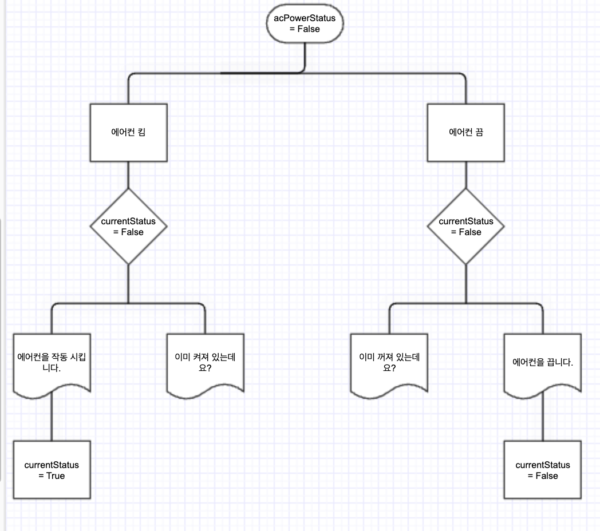
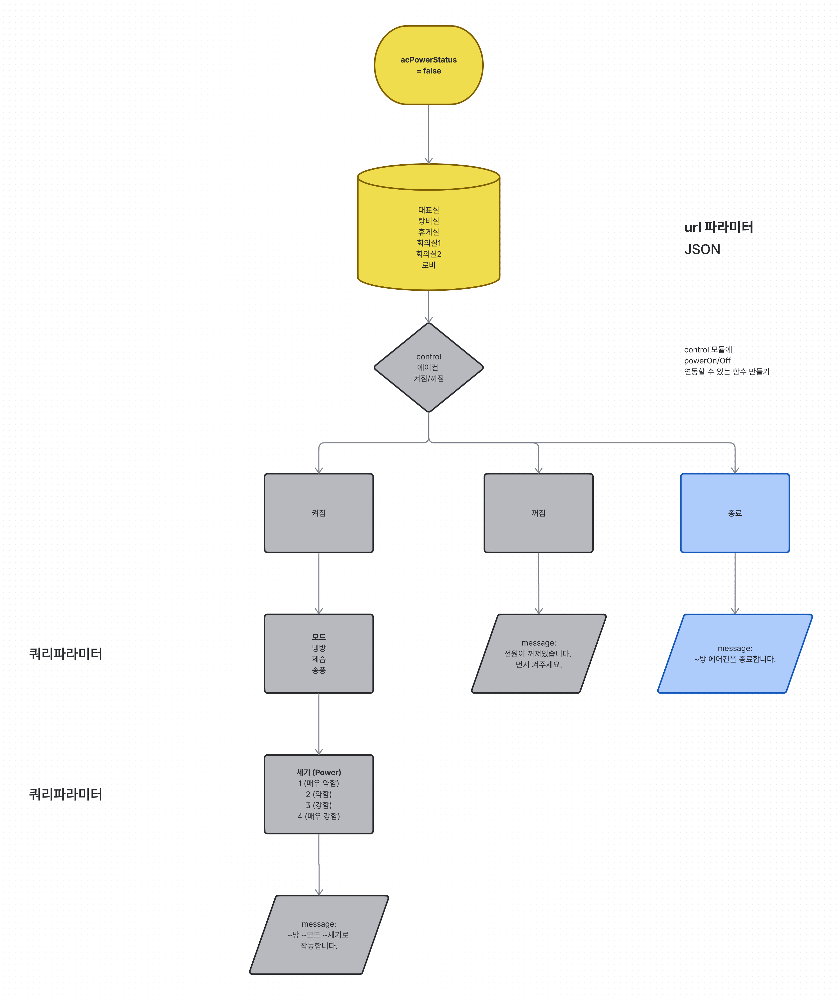

# 사내 시설별 에어컨 제어 API (스터디 프로젝트)

woojoocat 개인 프로젝트를 진행하던 중 API 설계와 라우팅 감각을 다지기 위해 2026.07.23~08.09 동안 범위를 바꿔 진행한 스터디 프로젝트입니다. "대표실, 탕비실, 휴게실 등 사내 여러 시설의 에어컨을 각각 제어한다"는 가상 시나리오를 세우고, 방 이름을 URL 경로로 받는 동적 라우팅부터 상태 판정, 응답 메시지 조립까지 하나의 엔드포인트로 구현했습니다. woojoocat 프로젝트의 구현 실적이 아니라 별도의 학습 프로젝트입니다.

## 프로젝트 기간

2026.07.23 ~ 2026.08.09

## 진행 배경

원래 진행하던 프로젝트는 woojoocat이지만, 다음 단계로 넘어가기 전에 API 라우팅과 타입 설계를 집중적으로 연습할 필요가 있었습니다. 이 스터디를 발판으로 woojoocat 프로젝트를 재개하는 흐름으로 정리했습니다.

## 다룬 내용

### 라우팅 설계

- `[room]` 동적 라우트 세그먼트로 방 이름을 URL 경로 파라미터로 받도록 구성 (예: `/api/ac/탕비실`). 대괄호 없는 `room` 폴더는 고정된 경로만 매칭되고 임의의 방 이름은 받을 수 없어, 방 이름 자체를 리소스 식별자로 다루기 위해 `[room]`으로 설계.
- `action`(on/off), `mode`(냉방/제습/송풍), `power`(1~4)는 쿼리 파라미터로 분리. 경로 파라미터는 "어떤 리소스인가"를 나타내는 필수 식별자, 쿼리 파라미터는 부가 조건이라는 기준으로 구분.

### 모듈 구조

state → validation → control → output → route 순서로 의존 관계를 두고 파일을 분리했습니다.

- `rooms.ts`: 방별 상태(acStatus, mode, power)를 객체로 관리
- `validation.ts`: mode/power/action 각각의 입력값이 허용 범위 안에 있는지 검증하는 함수를 분리. 범위를 벗어나면 Error를 throw
- `control.ts`: 현재 상태와 요청을 비교해 turnOn / alreadyOff / turnOff 세 가지 결과로 분기. 반환 타입은 discriminated union(status 필드로 구분되는 유니언 타입)으로 설계해 상태별로 필요한 필드(mode, power 유무)가 다른 문제를 해결
- `output.ts`: control의 결과를 받아 템플릿 리터럴로 상태별 메시지 문자열 조립
- `route.ts`: 위 모듈들을 호출하는 HTTP 진입점 역할만 담당

### 타입 설계

- `keyof` 연산자로 존재하는 방 이름만 허용 (`roomName: keyof roomAc`)
- 쿼리 파라미터처럼 외부에서 들어오는 값은 컴파일 타임에 검증할 수 없으므로, 런타임 검증 함수를 통과시킨 뒤에만 타입 단언(`as`)을 사용. `as`를 먼저 쓰지 않고 검증 함수를 우선하는 순서로 안전성 확보
- 쿼리 파라미터는 항상 문자열로 들어오므로 `Number()` 변환 후 범위 검증

### 테스트

Postman으로 각 엔드포인트를 로컬에서 직접 호출해 확인 (`GET /api/ac/탕비실?action=on&mode=냉방&power=2` 등)

## API 예시

```
GET /api/ac/[room]?action=on&mode=냉방&power=2
GET /api/ac/탕비실?action=off
```

## 기술 스택

- Next.js 15/16 (App Router)
- React 19
- TypeScript

## 이 스터디의 포인트

- 전역 변수를 모듈 간 직접 import해서 재할당하는 방식은 동작하지 않았고, getter/setter 함수로 감싸는 클로저 패턴으로 바꿔 해결
  
- 방 상태를 하드코딩된 if문으로 분기하려다, 방이 늘어도 코드 수정이 필요 없도록 대괄호 표기법 기반의 동적 접근(`roomsAc[roomName as keyof roomAc]`)으로 리팩토링
  
- 반환 타입에 `undefined`가 섞이는 버그가 있었는데, 두 번째 if를 else로 바꾸고 discriminated union을 도입해 타입 레벨에서 차단
- 경로 파라미터와 쿼리 파라미터를 "필수 식별자 vs 부가 조건" 기준으로 나눠 설계한 점

## 실행 방법

```bash
pnpm install
pnpm run dev
```

개발 서버를 실행한 뒤 `http://localhost:3000/api/ac/[방이름]?action=on&mode=냉방&power=2` 형태로 확인할 수 있습니다.
